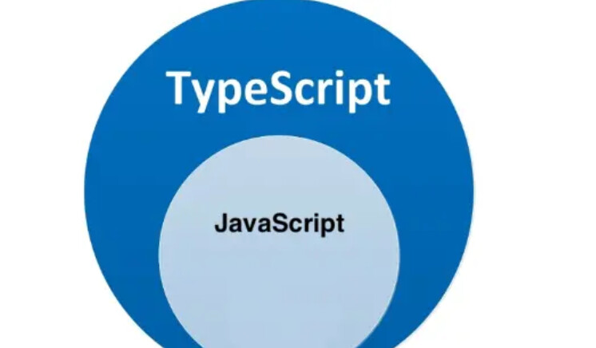

# 1.简介

## 1.1 TypeScript简介

- [TS 官方文档](https://link.juejin.cn/?target=https%3A%2F%2Fwww.typescriptlang.org%2F)

1. **`TypeScript` 简称：TS，是 JavaScript 的超集**，简单来说就是：JS 有的 TS 都有。
2. 它对JS进行了扩展，向JS中引入了类型的概念，并添加了许多新的特性。
3. TS代码需要通过编译器编译为JS，然后再交由JS解析器执行。
4. TS完全兼容JS，换言之，任何的JS代码都可以直接当成JS使用。
5. 相较于JS而言，TS拥有了静态类型，更加严格的语法，更强大的功能；TS可以在代码执行前就完成代码的检查，减小了运行时异常的出现的几率；TS代码可以编译为任意版本的JS代码，可有效解决不同JS运行环境的兼容问题；同样的功能，TS的代码量要大于JS，但由于TS的代码结构更加清晰，变量类型更加明确，在后期代码的维护中TS却远远胜于JS。

> TS和JS之间的关系其实就是Less/Sass和CSS之间的关系
> 就像Less/Sass是对CSS进行扩展一样, TS也是对JS进行扩展
> 就像Less/Sass最终会转换成CSS一样, 我们编写好的TS代码最终也会换成JS

## 1.2 为什么要有 typescript

- 背景：JS 的类型系统存在“先天缺陷”弱类型，JS 代码中绝大部分错误都是类型错误（Uncaught TypeError）
  - 开发的时候，定义的变量本应该就有类型
- 这些经常出现的错误，导致了在使用 JS 进行项目开发时，增加了找 Bug、改 Bug 的时间，严重影响开发效率
- 从编程语言的动静来区分，**TypeScript 属于静态类型的编程语言**，**JavaScript 属于动态类型的编程语言**
  - 静态类型：**编译**期做类型检查
  - 动态类型：**执行**期做类型检查
- 代码编译和代码执行的顺序：1 编译 2 执行
- 对于 JS 来说：需要等到代码真正去执行的时候才能发现错误（晚）
- 对于 TS 来说：在代码编译的时候（代码执行前）就可以发现错误（早）

并且，配合 VSCode 等开发工具，TS 可以提前到**在编写代码的同时就发现代码中的错误**，减少找 Bug、改 Bug 时间

对比：

- 使用 JS：
  1. 在 VSCode 里面写代码
  2. 在浏览器中运行代码 --> 运行时，才会发现错误【晚】
- 使用 TS：
  1. 在 VSCode 里面写代码 --> 写代码的同时，就会发现错误【早】
  2. 在浏览器中运行代码

> 简单来说就是因为JavaScript是弱类型, 很多错误只有在运行时才会被发现
> 而TypeScript提供了一套静态检测机制, 可以帮助我们在编译时就发现错误

## 1.3 TypeScript相比JS的优势

1. 更早（写代码的同时）发现错误，减少找Bug、改Bug时间，提升开发效率。
2. 程序中任何位置的代码都有提示，随时随地的安全感，增强了开发体验。
3. 强大的类型系统提升了代码的可维护性，使得重构代码更加容易。
4. 支持最新的ECMAScript语法，优先体验最新的语法，让你走在前端技术的最前沿。
5. TS类型判断机制，不需要再代码中的每个地方都演示标注类型，让你在享受优势的同时，尽量降低来了成本。

除此之外，Vue 3 源码使用 TS 重写、Angular 默认支持 TS、React 与 TS 完美配合，TypeScript  已成为大中型前端 项目的首选编程语言。

目前，前端最新的开发技术栈：

1. React： TS + Hooks
2. Vue： TS + Vue3

- 注意： Vue2 对 TS 的支持不好~
