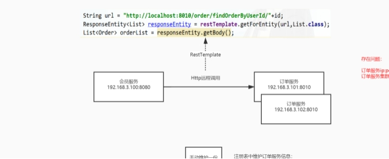
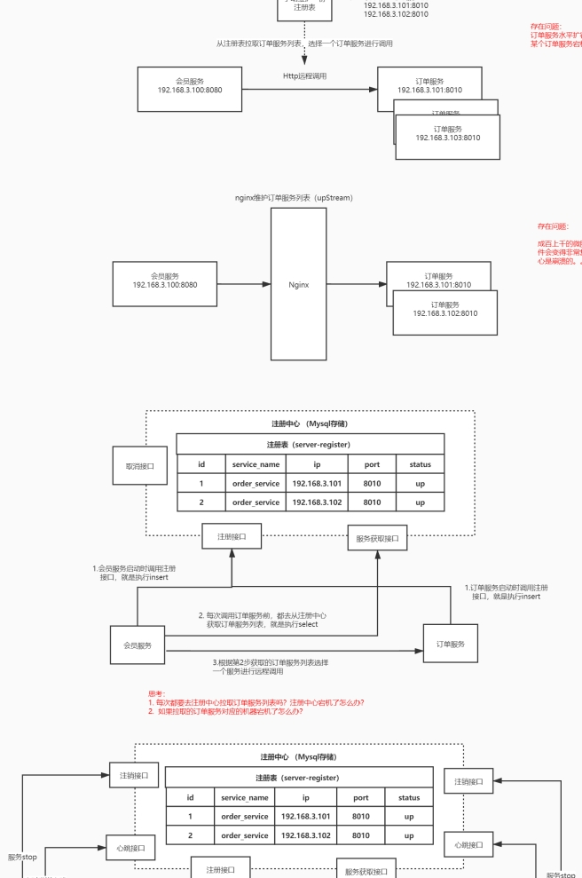
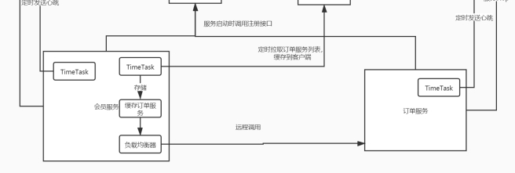

# Alibaba微服务组件Nacos注册中心

## 1. 什么是Nacos

​      官方： 一个更易于构建云原生应用的动态服务发现([Nacos Discovery](https://github.com/alibaba/spring-cloud-alibaba/wiki/Nacos-discovery))、服务配置([Nacos Config](https://github.com/alibaba/spring-cloud-alibaba/wiki/Nacos-config)和服务管理平台。

* 集注册中心 + 配置中心 + 服务管理 平台

* Nacos 的关键特性包括:

* 服务发现和服务健康监测

* 动态配置服务

* 动态 DNS 服务

* 服务及其元数据管理

## 2. Nacos注册中心

管理所有微服务、解决微服务之间调用关系错综复杂、难以维护的问题；

### 2.1 注册中心演变及其设计思想
<p>
  
  
  
</p>
### 2.3  核心功能

[Nacos Discovery](https://github.com/alibaba/spring-cloud-alibaba/wiki/Nacos-discovery)

***服务注册*** ：Nacos Client会通过发送REST请求的方式向Nacos Server注册自己的服务，提供自身的元数据，比如ip地 址、端口等信息。 Nacos Server接收到注册请求后，就会把这些元数据信息存储在一个双层的内存Map中。

***服务心跳***：在服务注册后， Nacos Client会维护一个定时心跳来持续通知Nacos Server，说明服务一直处于可用状态，防 止被剔除。默认5s发送一次心跳。

***服务同步*** ：Nacos Server集群之间会互相同步服务实例，用来保证服务信息的一致性。  leader  raft

***服务发现***：服务消费者（Nacos Client）在调用服务提供者的服务时，会发送一个REST请求给Nacos Server，获取上面 注册的服务清单，并且缓存在Nacos Client本地，同时会在Nacos Client本地开启一个定时任务定时拉取服务端最新的注 册表信息更新到本地缓存

***服务健康检查*** ：Nacos Server会开启一个定时任务用来检查注册服务实例的健康情况，对于超过15s没有收到客户端心跳 的实例会将它的healthy属性置为false(客户端服务发现时不会发现)，如果某个实例超过30秒没有收到心跳，直接剔除该  实例(被剔除的实例如果恢复发送心跳则会重新注册)

***主流的注册中心***

CAP   C 一致性 A可用性 P 分区容错性

 

雪崩保护：

保护阈值：  设置0-1之间的值  0.6

临时实例：  spring.cloud.nacos.discovery.ephemeral =false,  当服务宕机了也不会从服务列表中剔除

下图代表永久实例：

 

健康实例、  不健康实例；

健康实例数/总实例数 < 保护阈值`

1/2<0.6

 

结合负载均衡器 权重的机制，  设置的越大

 

## 3. Nacos Server部署

***下载源码编译***

源码下载地址：  https://github.com/alibaba/nacos/   可以用迅雷下载

```shell
cd nacos/
mvn ‐Prelease‐nacos clean install ‐U
cd nacos/distribution/target/
```

***下载安装包***

下载地址：  https://github.com/alibaba/Nacos/releases

### 3.1 单机模式

官方文档：  https://nacos.io/zh-cn/docs/deployment.html

解压，进入nacos 目录

 

单机启动nacos，执行命令

```sh
 bin/startup.sh ‐m standalone
```

也可以修改默认启动方式

 

访问nocas的管理端：  http://192.168.3.14:8848/nacos ，默认的用户名密码是 nocas/nocas

 

### 3.2 集群模式

1.jdk1.8+

2.maven 3.3+

3.nginx 作为负载均衡

4.mysql

官网文档：  https://nacos.io/zh-cn/docs/cluster-mode-quick-start.html

集群部署架构图

 

1.下载

```shell
mkdir nacos
wget https://github.com/alibaba/nacos/releases/download/1.4.1/nacos‐server‐1.4.1.tar.gz
```

创建多个nacos server

重复三次 

```shell
tar ‐zxvf nacos‐server‐1.4.1.tar.gz
mv nacos nacos8849
```

1）单机搭建伪集群，复制nacos安装包，修改为nacos8849 ，nacos8850 ，nacos8851

 

2）以nacos8849为例，进入nacos8849目录

2.1）修改conf\application.properties的配置，使用外置数据源 要使用mysql5.7+（包括）

``` properties
#使用外置mysql数据源
spring.datasource.platform=mysql
### Count of DB:
db.num=1
### Connect URL of DB:
db.url.0=jdbc:mysql://127.0.0.1:3306/nacos?characterEncoding=utf8&connectTimeout=1000&socketTimeout=3000&autoReconnect=true&useUnicode=true&useSSL=false&serverTimezone=UTC
db.user.0=root
db.password.0=root
```

 

2.2）将conf\cluster.conf.example改为cluster.conf,添加节点配置

```config
# ip:port
192.168.65.220:8849
192.168.65.220:8850
192.168.65.220:8851
```

nacos8850 ，nacos8851 按同样的方式配置。

3）创建mysql数据库,sql文件位置： conf\nacos-mysql.sql

4)  如果出现内存不足：修改启动脚本（bin\startup.sh）的jvm参数

> JAVA_OPT="${JAVA_OPT} ‐server ‐Xms512m ‐Xmx512m ‐Xmn256 ‐XX:MetaspaceSize=64m ‐XX:MaxMetaspaceSize=128m"

 

5)  分别启动nacos8849 ，nacos8850 ，nacos8851

以nacos8849为例，进入nacos8849目录，启动nacos

> bin/startup.sh

 

6) 测试

登录 http://192.168.3.14:8849/nacos ，用户名和密码都是nacos

 

下载nginx

 ```
1.添加官方源仓库
yum install ‐y yum‐utils
yum‐config‐manager ‐‐add‐repo https://openresty.org/package/centos/openresty.repo

2.安装openresty
yum install ‐y openresty

cd /usr/local/openresty/
 ```

7）官方推荐，nginx反向代理  

192.168.56.220:8847/nacos/

 ```
 upstream nacoscluster {
  server 127.0.0.1:8849;
  server 127.0.0.1:8850;
  server 127.0.0.1:8851;
 }
  server {
  listen 8847;
  server_name localhost;

  location /nacos/{
  proxy_pass http://nacoscluster/nacos/;
 }
 }
 ```

 

访问： [http://192.168.3.14:8847/nacos](http://192.168.3.14:8849/nacos)

1.3  prometheus + grafana监控Nacos（扩展）

https://nacos.io/zh-cn/docs/monitor-guide.html

Nacos 0.8.0版本完善了监控系统，支持通过暴露metrics数据接入第三方监控系统监控Nacos运行状态。

 1. nacos暴露metrics数据

> management.endpoints.web.exposure.include=*

测试： http://localhost:8848/nacos/actuator/prometheus

 

2. prometheus采集Nacos metrics数据

启动prometheus服务

> prometheus.exe ‐‐config.file=prometheus.yml

测试： http://localhost:9090/graph

 

3. grafana展示metrics数据

测试： http://localhost:3000/

 

## 4. Spring Cloud AlibabaNacos快速开始

### 4.1 Spring Cloud Alibaba版本选型

 

### 4.2 搭建Nacos-client服务

1）引入依赖

父Pom中支持spring cloud&spring cloud alibaba, 引入依赖

```xml
<dependencyManagement>
<dependencies>
<!‐‐引入springcloud的版本‐‐>
<dependency>
<groupId>org.springframework.cloud</groupId>
<artifactId>spring‐cloud‐dependencies</artifactId>
<version>Hoxton.SR3</version>
<type>pom</type>
<scope>import</scope>
 </dependency>
 <dependency>
 <groupId>com.alibaba.cloud</groupId>
 <artifactId>spring‐cloud‐alibaba‐dependencies</artifactId>
 <version>2.2.1.RELEASE</version>
 <type>pom</type>
 <scope>import</scope>
 </dependency>
 </dependencies>
 </dependencyManagement>
```

当前项目pom中引入依赖

```xml
<dependency>
 <groupId>com.alibaba.cloud</groupId>
 <artifactId>spring‐cloud‐starter‐alibaba‐nacos‐discovery</artifactId>
</dependency>
```

2) application.properties中配置

```properties
server.port=8002
#微服务名称
spring.application.name=service‐user
#配置 Nacos server 的地址
spring.cloud.nacos.discovery.server‐addr=localhost:8848
```

更多配置：  https://github.com/alibaba/spring-cloud-alibaba/wiki/Nacos-discovery


3）启动springboot应用， nacos管理端界面查看是否成功注册


4）测试

使用RestTemplate进行服务调用，可以使用微服务名称 （spring.application.name）
```java
String url = "http://service‐order/order/findOrderByUserId/"+id;
List<Order> orderList = restTemplate.getForObject(url, List.class);
```
**注意： 需要添加@LoadBalanced注解**

 ```java
 @Bean
 @LoadBalanced
 public RestTemplate restTemplate() {
 return new RestTemplate();
 }
 ```

### 4.3  Nacos注册中心架构

 